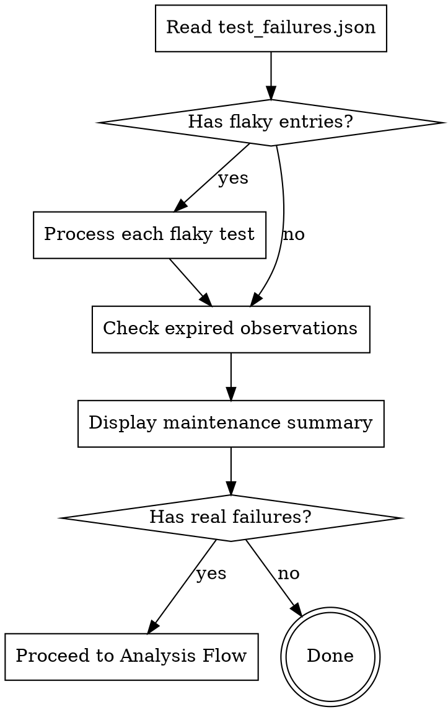

# UITest Failure Analysis

Analyze UITest failures from CI and provide handling recommendations.

## Pre-check

Before analysis, verify data availability:

1. Check if `$HOME/Downloads/UITestAnalysis/latest/` exists
2. Check data date:
   - **Today** → Use directly
   - **Past date** → Ask: "Data is from YYYY-MM-DD. Download latest data? Or use this?"
   - **Not exist** → Proceed to auto-download

**Auto-download when needed:**

If no data exists or user requests refresh:

1. Inform user: "⬇️ 下載最新測試資料..."
2. Verify script exists: `uitest-automation/scripts/download_uitest_data.sh`
3. Execute download:
   ```bash
   bash uitest-automation/scripts/download_uitest_data.sh
   ```
4. Check download result:
   - **Success** → Inform: "✅ 已下載最新測試資料 (位於 $HOME/Downloads/UITestAnalysis/latest/)"
   - **Failed** → Error: "❌ 自動下載失敗。請手動執行：`bash uitest-automation/scripts/download_uitest_data.sh`" and stop analysis
5. Verify data files present before proceeding

3. Check failure count from `test_summary.json` (`failedTests` field):
   - **No failures** → Proceed to Observation Maintenance (flaky tests may still exist)
   - **Has failures** → Proceed to step 4

4. Check existing report:
   - If `triage_report_YYYY-MM-DD.md` exists for today's data date
   - Ask: "今天已有分析報告，要繼續處理未完成項目嗎？"
   - **Yes** → Read report, identify items with ⏳ status, continue from Step 4
   - **No** → Start fresh analysis from Step 1

---

## Observation Maintenance

**Runs every time**, before failure analysis. Maintains `uitest-automation/observations/active.json`.



### M1: Identify Flaky Tests

Compare `test_failures.json` (initial failures) against `test_summary.json` (`failedTests` count):

- **`test_failures.json` has entries BUT `failedTests == 0`** → All entries are flaky (retry passed)
- **`test_failures.json` has more entries than `failedTests`** → Difference = flaky tests
- **Counts match** → No flaky tests, all are real failures

### M2: Update Observations for Flaky Tests

For each flaky test, check `active.json`:

| Situation | Action |
|-----------|--------|
| Already in `active.json` | Update `lastSeen` to today, `occurrences` +1 |
| Not in `active.json` | Add new entry with `decision: "observe"`, `occurrences: 1` |
| `occurrences` reaches ≥3 | Mark as `escalate_recommended: true` |

**New observation entry format:**
```json
{
  "id": "<TestClass>.<testMethod>",
  "firstSeen": "YYYY-MM-DD",
  "lastSeen": "YYYY-MM-DD",
  "occurrences": 1,
  "pattern": "<pattern_id or FLAKY>",
  "decision": "observe",
  "expiresOn": "YYYY-MM-DD+1",
  "notes": "<error message>. Retry 後通過（flaky）。"
}
```

**Default `expiresOn`:** Next day (today + 1). User may override.

### M3: Check Expired Observations

For each entry in `active.json` where `expiresOn <= today`:

| Situation | Action |
|-----------|--------|
| Expired + NOT in today's `test_failures.json` | Recommend removal |
| Expired + still flaky today | Recommend escalation to Investigate |
| Not expired | No action |

### M4: Display Maintenance Summary

```
📋 觀察維護結果
━━━━━━━━━━━━━━━━━━━━━━━━━━━━━━━━━━━
日期：YYYY-MM-DD

🔄 Flaky Tests（retry 後通過）：N 個
   ┌────────────────────────────────
   │ • <test_name> — <error> (第 N 次出現)
   └────────────────────────────────

⚠️ 建議升級調查（≥3 次）：N 個
   ┌────────────────────────────────
   │ • <test_name> — 已連續 N 次 flaky
   └────────────────────────────────

🗑️ 建議移除（到期且未再出現）：N 個
   ┌────────────────────────────────
   │ • <test_name> — 最後出現 YYYY-MM-DD
   └────────────────────────────────

✅ 仍在觀察中：N 個
━━━━━━━━━━━━━━━━━━━━━━━━━━━━━━━━━━━
```

### M5: User Confirmation

- **建議移除的項目** → 列出，等使用者確認後才從 `active.json` 刪除
- **建議升級的項目** → 列出，使用者決定是否進入 Investigate
- **Flaky 更新** → 自動執行，告知使用者結果

After maintenance, if no real failures exist → End with summary. Do NOT generate triage report.

---

## Analysis Flow

### Step 1: Analyze Each Failure

For each failure in the CI data, determine a recommendation:

**1a. Check Known Patterns**

Query [patterns.md](references/patterns.md). Use **first match** by this priority:

1. **Exact test name** — Pattern specifies exact test name
2. **Error message keyword** — Error contains trigger text
3. **Test name regex + error combo** — Both conditions match

**Multiple matches?** Use the pattern with more specific conditions.

If matched → Use pattern's recommended action and skip to Step 2 (history check).

**1b. Check History**

Query `uitest-automation/observations/active.json` (already maintained by Observation Maintenance step):

- If test is under observation and failed again → Escalate (observe → investigate/fix)
- If first occurrence → Continue to classification

**1c. Classify by Error Characteristics**

| Error Characteristic | Recommendation |
|---------------------|----------------|
| timeout, network error | Observe |
| element not found + short duration | Observe |
| element not found + first occurrence | Investigate |
| crash, fatal error, SIGABRT | Investigate |
| credential, auth, 401 | Investigate |
| UAT cleanup failed | Restore |
| assertion failure | Investigate |

### Step 2: Group Results

Group failures by recommended action, then identify same-source failures within each group.

**Same-Source Detection (priority order):**
1. **Same Pattern ID** — Both match same pattern in patterns.md
2. **Same Test Name Prefix** — e.g., `SSO_Login` and `SSO_Logout` → "SSO 群組"

### Step 3: Output Summary

Display grouped summary:

```
📊 UITest 失敗分析結果
━━━━━━━━━━━━━━━━━━━━━━━━━━━━━━━━━━━
日期：YYYY-MM-DD
總失敗數：N 個
資料來源：CI Build #XXX

🟡 建議 Observe (N 個)
   <same-source reasoning>
   ┌────────────────────────────────
   │ • <test_name>
   │   錯誤：<brief error message>
   └────────────────────────────────
   → 可批次記錄觀察

🔴 建議 Investigate (N 個)

   【<group_name> 群組】N 個 — <same-source reasoning>
   ┌────────────────────────────────
   │ • <test_name>
   │   錯誤：<brief error message>
   └────────────────────────────────
   → 建議一起下載截圖分析

🟠 建議 Restore (N 個)
   ┌────────────────────────────────
   │ • <test_name>
   │   錯誤：<brief error message>
   └────────────────────────────────
   → 環境問題，需手動處理

━━━━━━━━━━━━━━━━━━━━━━━━━━━━━━━━━━━
請選擇要處理的項目：
A) Observe 組 - 批次記錄觀察
B) Investigate: <group_name> - 分析
C) Restore 組 - 環境修復
D) 產生報告 - 整合所有分析結果
```

### Step 4: Process User Selection

**Processing Strategy:**

| Action | Strategy | Reason |
|--------|----------|--------|
| Observe | Batch | Low cost, just recording |
| Restore | Batch | Usually same environment issue |
| Investigate | Individual | Need screenshots to confirm each cause |
| Fix | Individual | Each may need different fix |

**Route to handler with context:**

| Target Skill | Context to Pass |
|--------------|-----------------|
| `investigating-uitest` | test_names, error_messages, same_source flag, pattern_id |
| `uitest-actions` | test_names, error_messages, action_type, batch flag |
| `reporting-uitest` | all_analysis_results, conclusions_so_far, test_date |

**Routing:**

- **Observe** → `uitest-actions` skill (action_type: observe, batch: true)
- **Investigate (same-source)** → `investigating-uitest` skill (same_source: true)
- **Investigate (unrelated)** → `investigating-uitest` skill (same_source: false)
- **Restore** → `uitest-actions` skill (action_type: restore)
- **Report** → `reporting-uitest` skill

### Step 5: Loop or Complete

After processing user's selection:

**Receiving results from sub-skills:**

Sub-skills return structured results:

| Field | Description |
|-------|-------------|
| processed_tests | Test names that were handled |
| conclusion | Final determination (Fix/Restore/Observe/Report) |
| summary | One-line result description |

Update group status: `✓ <group> - <conclusion> (<summary>)`

**Updated summary format:**
```
✓ Observe 組 - 已記錄 3 筆觀察
B) Investigate: SSO 群組 - 待分析
C) Restore 組 - 待處理
```

**Loop decision:**
- **More unprocessed groups?** → Return to Step 3 (show summary with ✓ marks)
- **All groups processed?** → Proceed to report generation
- **User wants to stop early?** → Generate report with current progress (✓ = done, ⏳ = pending)

**Report as checkpoint:** When session ends or user stops, always generate report via `reporting-uitest`. The report serves as checkpoint - next session can resume by reading the report and continuing unfinished items.

---

## Learning Loop

Analysis results should feed back into the system:

### Escalation Thresholds

| Status | Trigger | Action |
|--------|---------|--------|
| Under Observation | 3+ consecutive failures | Escalate to Investigate |
| Under Observation | Same error in 3+ different tests | Escalate to Investigate |
| Investigated | Root cause confirmed | Create Fix via OpenSpec |

### After Fix Deployed

When fix is verified working:

1. **Update patterns.md** — Add or update pattern with:
   - New trigger conditions (if discovered)
   - Historical case with date and archive link
2. **Close observation** — Remove from `active.json` via `uitest-actions`
3. **Consider automation** — Should this become auto-handled?

---

## Related References

- **Known Patterns**: [patterns.md](references/patterns.md) - Failure patterns with triggers and recommended actions
- **External Services**: [external-dependencies.md](references/external-dependencies.md) - External service behaviors and known issues
