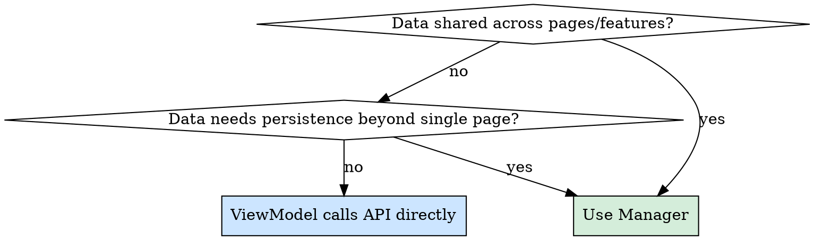

# Architecture Guide

## Overview

All architecture decisions follow the team-defined module hierarchy. The core question is: **does this data need to persist and be shared across pages/features?** The answer determines which pattern to use.

## Module Hierarchy

Three dependency paths govern data flow:

```
Path 1: View -> FeatureToggle -> XXXManager Protocol -> backend api
Path 2: View -> ViewModel -> XXXManager Protocol -> backend api
Path 3: View -> XXXManager's Published
```

| Path | Purpose |
|------|---------|
| Path 1 | Feature flag checks — is feature enabled, which data is accessible |
| Path 2 | Data operations — fetch, write, business logic via ViewModel orchestration |
| Path 3 | Data observation — View directly observes Manager's @Published for rendering |

## Decision: Do You Need a Manager?



| Condition | Manager | No Manager |
|-----------|:-------:|:----------:|
| Data used by multiple pages/features (e.g., floor plans, devices) | Yes | |
| Data needs single source of truth across the app | Yes | |
| Data only used on one page (e.g., messages, AI control settings) | | Yes |
| Simple fetch-display-discard lifecycle | | Yes |

## Pattern A: With Manager (Cross-Page/Shared Data)

All three module hierarchy paths apply.

### Manager Responsibilities

- Pure API data transformation (Backend model -> UI model)
- Caching with `@Published` properties (single source of truth)
- **No cross-Manager dependencies** — Manager only depends on API layer
- Expose write methods for ViewModel to update assembled data
- Throw errors (don't handle — let ViewModel decide presentation)
- Format conversion belongs in Manager (e.g., parsing API serial numbers)

### ViewModel Responsibilities

- Thin orchestrator: trigger fetches, not hold data
- Cross-Manager data assembly (e.g., combining data from two Managers)
- Write assembled data back to Manager via write methods
- Subscribe to other Managers' streams for reactive sync
- UI-only state (`isLoading`, `selectedID`, `zoomScale`)
- Error presentation (`appManager.handleError`)
- Navigation decisions

### View Responsibilities

- Observe Manager's `@Published` directly for data (Path 3)
- Observe ViewModel for UI-only state
- Pure rendering, no logic

### Data Flow

```
View.onAppear
  -> ViewModel.onViewAppear()
    -> manager.fetchData()         // Manager fetches from API, caches in @Published
    -> ViewModel assembles cross-Manager data if needed
    -> manager.setXxx(assembled)   // ViewModel writes back to Manager
  -> View auto-refreshes           // View observes Manager's @Published directly
```

### Reactive Sync (Cross-Manager Data)

When ViewModel needs to combine data from multiple Managers:

```
OtherManager data changes
  -> ViewModel receives via AsyncStream subscription
  -> ViewModel re-assembles data
  -> ViewModel writes updated data to Manager via write method
  -> Manager's @Published updates
  -> View auto-refreshes
```

**Key principle:** Manager stores, ViewModel orchestrates timing and assembly.

## Pattern B: Without Manager (Page-Scoped Data)

Only Path 2 applies (View -> ViewModel -> API).

### ViewModel Responsibilities

- Call API layer directly via `@Dependency`
- Hold `@Published` data state
- Handle errors, loading state, user interactions
- All data lifecycle tied to the page

### Data Flow

```
View.onAppear
  -> ViewModel.loadData()
    -> api.fetchXxx()              // ViewModel calls API directly
    -> ViewModel updates @Published state
  -> View observes ViewModel's @Published
```

## Layer Responsibilities Quick Reference

| Logic Type | Layer | Reason |
|------------|-------|--------|
| Observable UI state (isLoading, selection) | ViewModel | Screen-specific |
| User tap/swipe handler | ViewModel | User interaction |
| Navigation decisions | ViewModel | UI flow |
| Error presentation (handleError) | ViewModel | UI responsibility |
| Trigger fetch / refresh | ViewModel | Orchestration |
| Cross-Manager data assembly | ViewModel | Orchestration across boundaries |
| API calls | Manager (or ViewModel if no Manager) | Data layer |
| Backend -> UI model transform | Manager | Data transformation |
| Format parsing (API formats) | Manager | Data transformation |
| @Published data (shared) | Manager | Single source of truth |
| @Published data (page-scoped) | ViewModel | Page lifecycle |
| Cache management | Manager | Centralized |
| Throw errors (don't handle) | Manager | Let ViewModel decide |

## Model Separation

```
Backend Model (API Layer)          UI Model (Presentation Layer)
----------------------------       ----------------------------
- Matches API response             - Matches UI display needs
- Location: VortexBackend/Model/   - Location: Manager or Feature dir
- Decode only, no logic            - Can have computed properties
- Immutable                        - Mutable where ViewModel fills data
```

**Key principle:** UI Model should contain all info needed for rendering. Avoid View doing repeated lookups at render time — pre-populate in Manager or ViewModel.

## Common Mistakes

| Mistake | Fix |
|---------|-----|
| Manager depends on another Manager | Manager only depends on API. Move cross-Manager logic to ViewModel. |
| ViewModel duplicates Manager's @Published state | View observes Manager directly for shared data. ViewModel only holds UI-only state. |
| AsyncStream bridging @Published to ViewModel that re-publishes | Remove intermediary. View observes Manager's @Published directly. |
| Every feature gets a Manager | Only create Manager when data is shared cross-page. Page-scoped data stays in ViewModel. |
| View does lookup per render (e.g., findDevice for each marker) | Pre-populate in Manager transform or ViewModel assembly. |
| Manager handles error presentation | Manager throws. ViewModel catches and calls handleError. |
