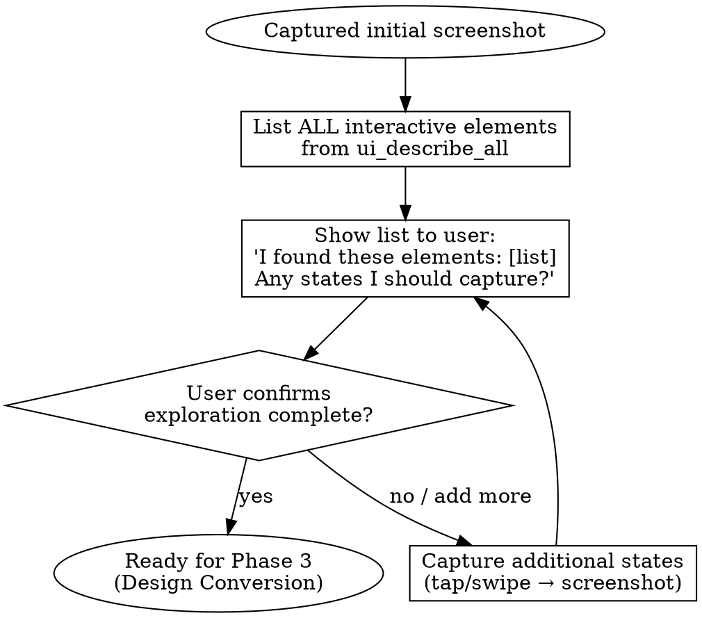

# Capture UI to Pencil

## Overview

Capture screens from iOS Simulator and convert them to Pencil design files. Uses AI to analyze UI structure and faithfully recreate the interface in Pencil.

**Key technique**: Use Task Agent for image-to-design conversion to avoid context window image accumulation.

## When to Use

- Creating design documentation from running app
- Recording different UI states
- Need to edit/modify existing app designs in Pencil

**Not for**: Pure design work (no app reference), design-to-code workflows

## Architecture

```
Main Conversation (Controller)
  - Operates iOS Simulator
  - Captures screenshots to file (NOT ui_view)
  - Resizes images to ≤2000px before passing to agents
  - Coordinates Task Agents
           │
           │ Every 3-4 screenshots
           ▼
Task Agent (Design Worker)
  - Receives resized screenshot path + accessibility data
  - Calls Pencil MCP to create design
  - Context released after completion (avoids accumulation)
```

## When to Move from Explore to Design



**STOP: Do NOT spawn Task Agent until user explicitly confirms exploration is complete.**

## Critical: Image Size Limit

Claude API limits images to **2000 pixels** (width or height) in multi-image requests.
iOS Simulator screenshots often exceed this (e.g., iPhone 15 Pro: 2556×1179).

**Solution**: Always save to file and resize before processing.

```bash
# Resize to max 2000px (maintains aspect ratio)
sips -Z 2000 /path/to/screenshot.png
```

## Workflow

### Phase 1: Setup

```
1. Check Simulator status
   mcp__ios-simulator__get_booted_sim_id

2. Open Simulator if needed
   mcp__ios-simulator__open_simulator

3. Launch target app (optional)
   mcp__ios-simulator__launch_app
```

### Phase 2: Explore UI

```
1. Ask user what to explore
   e.g., "Explore View Tab states"

2. Capture screen + UI structure
   # Save screenshot to file (NOT ui_view - avoid context accumulation)
   mcp__ios-simulator__screenshot(output_path="/tmp/capture_001.png")

   # Resize to ≤2000px for Claude API compatibility
   Bash: sips -Z 2000 /tmp/capture_001.png

   # Get accessibility info (text-based, no size issues)
   mcp__ios-simulator__ui_describe_all → accessibility info

3. AI analyzes interactive elements, plans operations
   - Expandable/collapsible items
   - Tab switches
   - Buttons (menus, modals)
   - Search bars

4. Execute and capture different states
   mcp__ios-simulator__ui_tap / ui_swipe
   Repeat steps 2-3 (increment filename: capture_002.png, etc.)

5. Present findings to user (REQUIRED)
   "I found these interactive elements:
    - [X] Tabs: [list tab names]
    - [X] Buttons: [list buttons and expected behavior]
    - [X] Expandable items: [list]
    - [X] Other: [inputs, search bars, etc.]

    I've captured [N] states. Any other states to explore?"

6. User confirmation (REQUIRED before Phase 3)
   - User says "complete" / "done" / "that's all" → proceed to Phase 3
   - User requests more → go back to step 4
```

#### Exploration Completion Checklist

**STOP: Verify before spawning Task Agent:**

- [ ] Listed ALL interactive elements from ui_describe_all to user
- [ ] Categorized: tabs, buttons, expandable items, inputs
- [ ] Captured each major state (tabs, expanded/collapsed, modals)
- [ ] Asked user: "Any states I should capture?"
- [ ] User explicitly confirmed exploration is sufficient

**Red flags - exploration NOT complete:**
- Only captured 1-2 screenshots of complex screen
- Skipped tabs or expandable sections
- Didn't show user the interactive element list
- User didn't explicitly say "done" or "complete"
- Rationalized "this is enough" without user confirmation

**All red flags mean: DO NOT proceed to Phase 3. Complete exploration first.**

### Phase 3: Convert to Design (Task Agent)

**Important**: Spawn Task Agent every 3-4 screenshots to avoid image accumulation.

```
1. Ask output location
   - New .pen file
   - Add to existing .pen file

2. Spawn Task Agent
   Task tool with subagent_type="general-purpose"

3. Task Agent executes:
   - mcp__pencil__find_empty_space_on_canvas
   - mcp__pencil__batch_design
   - mcp__pencil__get_screenshot (verify)

4. Main conversation receives completion, continues next batch
```

## Task Agent Prompt Template

```
Create Pencil design from the following UI info.

**Target file**: {pen_file_path}
**Screen name**: {screen_name}

**Screenshot** (already resized to ≤2000px):
{screenshot_file_path}
Use Read tool to view the screenshot file.

**UI Structure** (from iOS Simulator accessibility):
{ui_describe_all_output}

**Steps**:
1. Read the screenshot file to see the UI visually
2. mcp__pencil__find_empty_space_on_canvas
3. mcp__pencil__batch_design
   - Frame: 402x874 (iPhone)
   - Dark mode: #121212 bg, #FFFFFF text
   - Create components from accessibility info
4. mcp__pencil__get_screenshot to verify
5. Report completion with created node IDs
```

## Key MCP Tools

| Tool | Purpose |
|------|---------|
| `get_booted_sim_id` | Get running Simulator ID |
| `open_simulator` | Open Simulator |
| `launch_app` | Launch specified app |
| `screenshot` | Save screen to file (use this, NOT ui_view) |
| `ui_describe_all` | Get UI accessibility structure |
| `ui_tap` | Tap at coordinates |
| `ui_swipe` | Swipe gesture |
| `batch_design` | Create Pencil design |
| `find_empty_space_on_canvas` | Find canvas space |
| `get_screenshot` | Verify design result |

### Bash Tools

| Command | Purpose |
|---------|---------|
| `sips -Z 2000 {path}` | Resize image to max 2000px (required before processing) |

## Common Mistakes

| Mistake | Fix |
|---------|-----|
| Use `ui_view` directly | Use `screenshot` + `sips -Z 2000` |
| Skip resizing before processing | Always resize to ≤2000px |
| Process all images in main conversation | Use Task Agent per batch |
| Accumulate too many screenshots | Spawn Task Agent every 3-4 |
| Ignore ui_describe_all | Structured data > pure screenshot |
| Hardcode coordinates | Use accessibility frame info |
| Skip exploration, jump to design | Complete Phase 2 checklist, get user confirmation |
| Don't list interactive elements to user | Always present findings before Phase 3 |
| Proceed without user "done" confirmation | User must explicitly confirm exploration complete |
| Capture only 1-2 screenshots of complex screen | Explore all tabs, states, expandable items first |

## Limitations

- **Image size limit**: Claude API limits images to 2000px in multi-image requests
- Max 3-4 screenshots per batch (context limit)
- Cannot capture complex animations
- Requires both iOS Simulator and Pencil MCP
