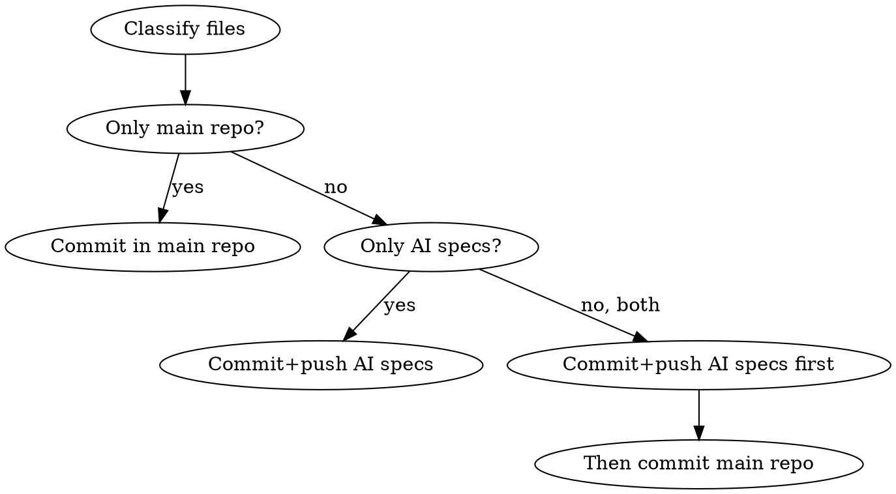

# Git Workflow

## Two-Repo Architecture

**Main Repo** (`iOSCharmander`): iOS app source code
**AI Specs Repo** (`iOSCharmander-ai-specs`): OpenSpec docs + AI configurations

`openspec/`, `.claude/`, `uitest-automation/` in main repo are **symlinks** to AI specs repo. They are in `.gitignore` — never commit them in main repo.

## Auto-Routing Commit Flow

When the user requests a commit, follow this flow **automatically** — do not ask which repo.

### Step 1: Classify changed files

Check for changes in **both** repos:

```bash
# Main repo
git status

# AI specs repo (resolve symlink path)
git -C "$(readlink openspec)/.." status
```

| Path Pattern | Target Repo |
|-------------|------------|
| `openspec/**` | AI specs repo |
| `.claude/**` | AI specs repo |
| `uitest-automation/**` | AI specs repo |
| Everything else | Main repo |

### Step 2: Route and commit



**Only main repo changes:** Stage and commit in `iOSCharmander` (follow branch/PR workflow).

**Only AI specs changes:**
1. `cd` to AI specs repo via symlink: `cd "$(readlink openspec)/.."`
2. `git add` the changed files
3. Commit and push to `main`

**Both repos have changes:**
1. AI specs first: `cd` to AI specs repo, stage, commit, push main
2. Then main repo: `cd` back, stage, commit (follow branch/PR workflow)

### Step 3: Report

After committing, report:
- Which repo(s) were committed to
- What files were included in each commit
- Whether AI specs were pushed to remote

## Commit Format

**Pattern**: `<type>(<project>): <description>`

**Projects**: `Vortex` or `CloudSight` or `iOSCharmander`

**Types**:
| Type | Use For |
|------|---------|
| `feat` | New feature |
| `fix` | Bug fix |
| `refactor` | Code restructuring |
| `docs` | Documentation |
| `test` | Tests |
| `chore` | Build, deps |

**Jira Reference**: When a commit relates to a Jira issue, add `refs: <ISSUE-KEY>` on a new line after the description. Issue keys vary by team (e.g. `ADAT-62`, `VOR-24280`).

- Only add `refs:` when the related issue is **known in the current session**
- If uncertain whether there's a related Jira issue, **ask the user** before committing
- Do NOT guess or assume issue keys

**Examples**:
```
feat(Vortex): add floor plan device selection

refs: ADAT-62
```
```
fix(CloudSight): resolve thread issue in video streaming

refs: VOR-24280
```
```
refactor(Vortex): extract TreeView component
```

## Guidelines
- Keep descriptions concise
- Use filename only (not full path)
- Confirm project name if uncertain
- AI specs repo: always direct push to `main` (no PR)
- Main repo: follow branch/PR workflow

## Branch Strategy

- `main`: Production-ready (PR target for main repo, direct push for AI specs)
- Feature branches: Descriptive names (`floorMap`, `feature-name`)

## File Management

**Adding files outside VortexFeatures**:
1. Update Xcode project file
2. Build to verify
3. VortexFeatures SPM files are auto-included

**Modifying project.pbxproj**: Use relative paths only.

## Red Flags — STOP

- About to `git add openspec/` or `.claude/` or `uitest-automation/` in main repo → **STOP**, these are symlinks in `.gitignore`
- About to commit without checking both repos for changes → **STOP**, always check both
- About to ask "which repo should I commit to?" → **STOP**, auto-detect from file paths
- User says "just commit everything" but both repos have changes → **STOP**, still split by repo
