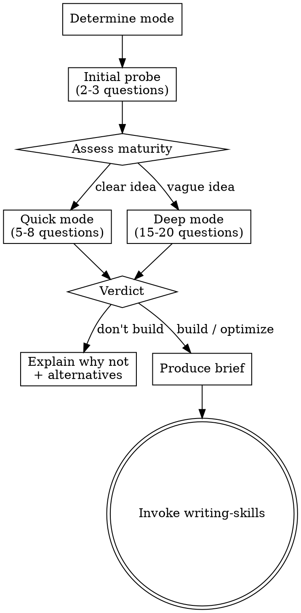

# Reviewing Skill Design

Evaluate skill ideas and existing skills through structured questioning, using the five agent skill design patterns (Tool Wrapper, Generator, Reviewer, Inversion, Pipeline) and writing-skills quality standards.

## Two Modes

| Mode | Trigger | Input |
|------|---------|-------|
| New skill evaluation | User describes a skill idea | Idea description |
| Existing skill optimization | User names a skill to review | Read that SKILL.md |

## Process Flow



## Phase 1 — Initial Probe

Ask 2-3 questions to understand the idea and gauge maturity:

- What problem does this skill solve? (or: what's wrong with the existing skill?)
- When would it trigger? What's the symptom or situation?
- Do you already have a rough picture of how it should work?

Based on answers, choose Quick or Deep mode.

## Phase 2 — Six-Dimension Review

Ask questions one at a time across these dimensions. In Quick mode, pick the most critical question per dimension. In Deep mode, explore each thoroughly.

### Dimension 1: Necessity

Is a skill the right solution?

- Is this a recurring problem or a one-off?
- Could this be a paragraph in CLAUDE.md instead?
- Does an existing skill already handle this? (scan `~/.kiro/skills/`)
- Could you modify an existing skill to cover this?

### Dimension 2: Pattern Fit

Which of the five patterns (or combination) applies?

| Pattern | Signal |
|---------|--------|
| Tool Wrapper | Needs to teach agent a specific library/framework/convention |
| Generator | Needs consistent, templated output every time |
| Reviewer | Needs to check/score against a checklist |
| Inversion | Needs to interview user before acting |
| Pipeline | Needs strict multi-step workflow with checkpoints |

- Describe what the skill does in one sentence — which pattern does that sentence sound like?
- Does it need to combine patterns? (e.g., Inversion → then Reviewer)
- If it doesn't fit any pattern, that's a red flag — why not?

### Dimension 3: Trigger Conditions

How will the agent discover and load this skill?

- What keywords or phrases should trigger it?
- Is the trigger distinct from existing skills, or will it collide?
- Can you write a "Use when..." description under 500 chars?

### Dimension 4: Relationship with Existing Skills

- List skills that overlap in domain or trigger
- Should this be a new skill, or a section added to an existing one?
- Does it need to cross-reference or invoke other skills?

### Dimension 5: Testability

- What does "working correctly" look like?
- What pressure scenario would make an agent skip or shortcut this skill?
- Can you define a clear pass/fail for a subagent test?

### Dimension 6: Token Efficiency

- How large will this skill be? (target: <500 words for normal skills)
- Does it need external reference files, or can it be self-contained?
- Is the value worth the context window cost?

## Phase 3 — Verdict

Based on the review, reach one of three conclusions:

### Don't Build

Reasons:
- Existing skill already covers it
- Too project-specific (belongs in CLAUDE.md)
- Small modification to existing skill suffices
- Doesn't fit any of the five patterns or their combinations

Action: Explain reasoning and suggest alternatives.

### Build New Skill

Action: Produce a Skill Design Brief (see format below).

### Optimize Existing Skill

Action: Produce a brief focused on what to change and why.

## Skill Design Brief Format

```markdown
# Skill Design Brief

## Overview
- Name: (suggested kebab-case name)
- Mode: New / Optimize (which existing skill)
- Verdict: Build / Optimize

## Problem Statement
(What this skill solves, in 2-3 sentences)

## Recommended Pattern
(Tool Wrapper / Generator / Reviewer / Inversion / Pipeline / combination)
- Why this pattern:

## Trigger Conditions
- Suggested description:
- Key trigger phrases:

## Design Outline
(Core logic, phases, gates, expected behavior)

## Relationship with Existing Skills
- Overlaps:
- Cross-references:
- Integration notes:

## Testability
- Success criteria:
- Suggested pressure scenarios:

## Notes
- Token budget estimate:
- Risks or concerns:
```

The brief stays in conversation context. Invoke writing-skills to begin implementation.

## Red Flags — STOP

- About to skip dimensions because "the idea is obviously good" → STOP, review all six
- About to say "build it" without checking existing skills for overlap → STOP, scan first
- User says "just make it" but idea doesn't fit any pattern → STOP, explain why
- About to produce brief before finishing all questions → STOP, complete the review
