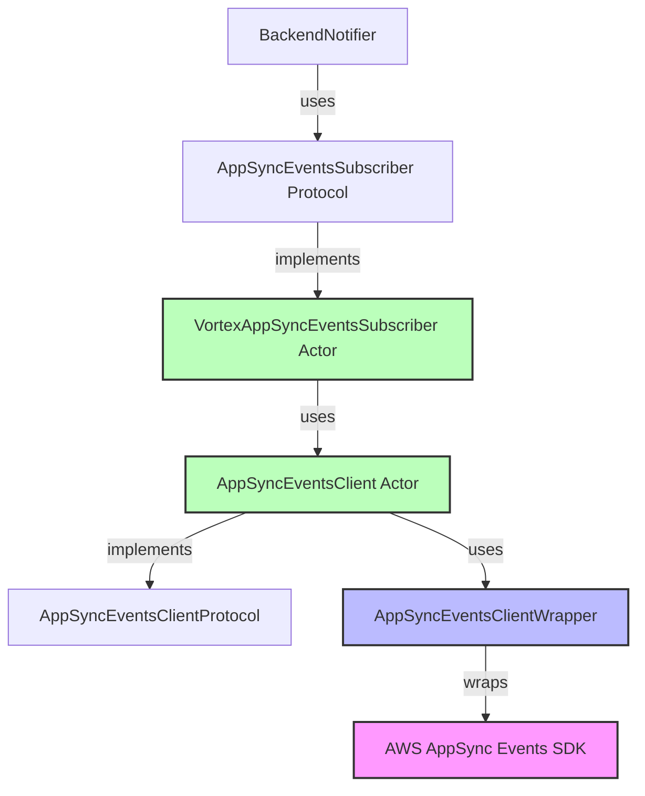

# Technical Design: iOS AppSync Events Integration

## Context

The VIVOTEK Vortex iOS app currently uses a custom GraphQL WebSocket implementation for real-time device state notifications. The implementation is located in:

- **VortexFeatures/Sources/VortexFeatures/Common/VortexBackend/BackendSubscriber/GraphQLSubscriber.swift**
- **VortexFeatures/Sources/VortexFeatures/Common/VortexBackend/BackendNotifier/BackendNotifier.swift**

This change migrates to AWS AppSync Events to align with the backend migration (see `/Users/ryanchen/code/AI/agentic-development-alignment-taskforce/docs/openspec/changes/switch-to-appsync-events`) and prepare infrastructure for future notification features.

### Stakeholders

- iOS team (AppSync Events client implementation)
- Backend team (AppSync Events publisher, schema coordination)
- QA team (testing migration, regression testing)

## Goals / Non-Goals

### Goals

- Replace GraphQL subscriptions with AppSync Events for all 9 subscription types
- Maintain sub-second latency for real-time updates
- Support existing authentication (JWT/Cognito) with AppSync Events
- Follow existing iOS architecture patterns (`AWSMqttClient` wrapper pattern)
- Reduce client-side library dependencies (remove custom GraphQL WebSocket code)
- Prepare infrastructure for future notification features

### Non-Goals

- Change event payload formats (maintain backward compatibility where possible)
- Replace the backend EventBus infrastructure
- Implement notifications in this change (future enhancement)
- Support both GraphQL and AppSync Events running simultaneously at runtime

## Decisions

### Decision 1: Follow AWSMqttClient Wrapper Pattern

**Choice**: Use existing AWSServices wrapper pattern for AppSync Events integration

**Pattern Structure**:



**Implementation**:

```swift
// Layer 1: Protocol Definition
public protocol AppSyncEventsClientProtocol: Sendable {
    func connect(region: String, endpoint: String) async throws
    func subscribe(channels: [String]) async throws -> AsyncStream<AppSyncEventMessage>
    func disconnect() async throws
}

// Layer 2: Actor Implementation
actor AppSyncEventsClient: AppSyncEventsClientProtocol {
    @Dependency(\.vortexAuthService) var authService
    @Dependency(\.appSyncEventsClientWrapper) var wrapper

    private let logger = VortexLogger.make(type: .appSyncEventsClient)
    private var connectionTask: Task<Void, Never>?

    func connect(region: String, endpoint: String) async throws {
        let token = try await authService.getJWTToken()
        connectionTask = Task { [weak self] in
            guard let states = try await self?.wrapper.connect(region, endpoint, token) else {
                throw VortexError.error("AppSync Events connection failed")
            }
            for try await state in states {
                try await self?.handleConnectionState(state)
            }
        }
    }
}

// Layer 3: SDK Wrapper (isolates AWS AppSync Events Swift SDK dependency)
actor AppSyncEventsClientWrapper {
    private let logger = VortexLogger.make(type: .appSyncEventsClientWrapper)
    private var appSyncClient: AppSyncEventBridgeClient?  // From aws-appsync-events-swift

    func connect(_ region: String, _ endpoint: String, _ token: String) async throws -> AsyncStream<ConnectionState> {
        // Use AppSyncEventBridgeClient from aws-appsync-events-swift
        let config = AppSyncEventBridgeConfig(
            endpoint: endpoint,
            region: region,
            authProvider: JWTAuthProvider(token: token)
        )
        appSyncClient = AppSyncEventBridgeClient(config: config)

        // SDK handles WebSocket connection automatically
        return AsyncStream { continuation in
            // Map SDK connection events to our ConnectionState
        }
    }
}
```

**Rationale**:
- **Official SDK**: Use AWS-maintained `aws-appsync-events-swift` instead of manual WebSocket implementation
- **Proven pattern**: `AWSMqttClient` uses same structure successfully
- **SDK advantages**: Built-in connection management, reconnection logic, protocol handling
- **Dependency isolation**: AWS SDK changes don't affect business logic
- **Testability**: Mock wrapper for unit tests
- **Actor safety**: Thread-safe by default with Swift actors
- **Follows project conventions**: Matches existing `openspec/project.md` architecture guidelines

**Alternatives Considered**:
1. **Manual WebSocket implementation**: More complex, error-prone, requires maintaining protocol implementation
2. **Direct SDK usage**: Too coupled, makes testing difficult
3. **Combine-based**: Project uses AsyncStream throughout
4. **Class-based with locks**: Swift actors are safer and simpler

### Decision 2: Consistent API - Split All Events by Channel

**Choice**: Split both device and organization events into separate methods, maintaining 1:1 mapping between backend channels and iOS methods

**Backend Architecture**:
- 9 separate user-level channels under `vortex-app/user/{userId}/*` pattern
- Each channel represents a distinct event type

**iOS Implementation - Consistent API**:
```swift
actor BackendNotifier {
    // Device events - 3 separate methods
    func devicePresenceValues() -> AsyncStream<DevicePresenceOutput>
    func deviceRecordingValues() -> AsyncStream<DeviceRecordingOutput>
    func deviceFirmwareValues() -> AsyncStream<DeviceFirmwareOutput>

    // Archive events
    func archiveValues() -> AsyncStream<ArchiveStateOutput>

    // Organization events - 3 separate methods
    func licenseValues() -> AsyncStream<LicenseStateOutput>
    func planValues() -> AsyncStream<PlanStateOutput>
    func aiSettingsValues() -> AsyncStream<AISettingsOutput>

    // User events
    func roleValues() -> AsyncStream<RoleChangeOutput>
    func revokeValues() -> AsyncStream<UserTokenRevokeOutput>
}
```

**Consumer Code (DeviceManager) - Updated**:
```swift
// Before (GraphQL)
Task {
    for await device in await backendNotifier.deviceValues() {
        await updateDeviceState(by: device)
    }
}

// After (AppSync Events - Consistent API)
Task {
    for await presence in await backendNotifier.devicePresenceValues() {
        await updateDeviceState(by: presence)
    }
}
Task {
    for await recording in await backendNotifier.deviceRecordingValues() {
        await updateDeviceState(by: recording)
    }
}
Task {
    for await firmware in await backendNotifier.deviceFirmwareValues() {
        await updateDeviceState(by: firmware)
    }
}
```

**Rationale**:
- **API consistency**: All backend channels map 1:1 to iOS methods (9 channels → 9 methods)
- **Clear semantics**: Method names clearly indicate what changed (devicePresenceValues, not deviceValues)
- **Predictable pattern**: Same design for device and organization events
- **Future extensibility**: Easy to add new channels without breaking pattern

**Trade-offs**:
- ✅ **Consistent design**: Easier to understand and maintain
- ✅ **Clear intent**: Each method has single responsibility
- ✅ **1:1 mapping**: Backend channel architecture visible in iOS API
- ❌ **More consumer changes**: DeviceManager needs 3 separate subscriptions instead of 1
- ❌ **More methods**: BackendNotifier has 9 methods instead of fewer merged methods

**Alternatives Considered**:
1. **Merge device events into single method**:
   - Pro: Minimal consumer code changes
   - Con: Inconsistent with organization events
   - Rejected: Consistency more important than minimal changes

### Decision 3: User-Level Channel Architecture

**Choice**: Use 9 user-level channels matching latest backend OpenAPI schema - ALL channels use `vortex-app/user/{userId}/*` pattern

**Channel Breakdown**:

| # | Channel Path | GraphQL Source | iOS Impact |
|---|--------------|----------------|------------|
| 1 | `vortex-app/user/{userId}/device/presenceChanged` | `DeviceStateOutput.online` | Existing field |
| 2 | `vortex-app/user/{userId}/device/recordingStateChanged` | `DeviceStateOutput.recording` | Existing field |
| 3 | `vortex-app/user/{userId}/device/firmwareUpdated` | `DeviceStateOutput.fwUpdateState` | Existing field |
| 4 | `vortex-app/user/{userId}/archive/stateChanged` | `ArchiveStateOutput` | Existing type |
| 5 | `vortex-app/user/{userId}/organization/licensePhaseChanged` | `OrganizationStateOutput.licensePhase` | **NEW** channel |
| 6 | `vortex-app/user/{userId}/organization/planChanged` | `OrganizationStateOutput.isFreePlan` | **NEW** channel |
| 7 | `vortex-app/user/{userId}/organization/aiSettingsChanged` | `OrganizationStateOutput.AIControlSetting` | **NEW** channel |
| 8 | `vortex-app/user/{userId}/roleChanged` | `RoleChangeOutput` | Existing type |
| 9 | `vortex-app/user/{userId}/tokenRevoked` | `UserTokenRevokeOutput` | Existing type |

**iOS Model Impact**:

**Before (GraphQL)**:
```swift
// Single OrganizationStateOutput for all organization state
public struct OrganizationStateOutput: Decodable, Sendable {
    public var isFreePlan: Bool?
    public var licensePhase: String?
    public var AIControlSetting: AIControlSettingOutput?
}
```

**After (AppSync Events)**:
```swift
// Split into 3 separate models
public struct LicenseStateOutput: Decodable, Sendable {
    public let eventType: String  // "license/phaseChanged"
    public let timestamp: String  // ISO 8601
    public let orgId: String
    public let licensePhase: String  // enum: SetupStatus, Valid, NoticePeriod, etc.
}

public struct PlanStateOutput: Decodable, Sendable {
    public let eventType: String  // "plan/typeChanged"
    public let timestamp: String
    public let orgId: String
    public let isFreePlan: Bool
}

public struct AISettingsOutput: Decodable, Sendable {
    public let eventType: String  // "ai/settingsChanged"
    public let timestamp: String
    public let orgId: String
    public let AIControlSetting: AIControlSettingOutput
}
```

**BackendNotifier API Change** (**BREAKING CHANGE**):
```swift
// Before (GraphQL)
func organizationValues() async -> AsyncStream<OrganizationStateOutput>

// After (AppSync Events) - organizationValues() is REMOVED
func licenseValues() async -> AsyncStream<LicenseStateOutput>
func planValues() async -> AsyncStream<PlanStateOutput>
func aiSettingsValues() async -> AsyncStream<AISettingsOutput>
```

**Consumer Code Migration Example**:
```swift
// Before
Task {
    for await orgState in await BackendNotifier.shared.organizationValues() {
        if let licensePhase = orgState.licensePhase {
            handleLicenseChange(licensePhase)
        }
        if let isFreePlan = orgState.isFreePlan {
            handlePlanChange(isFreePlan)
        }
        if let aiSettings = orgState.AIControlSetting {
            handleAISettingsChange(aiSettings)
        }
    }
}

// After (All consumers must update)
Task {
    async let license = Task {
        for await licenseState in await BackendNotifier.shared.licenseValues() {
            handleLicenseChange(licenseState.licensePhase)
        }
    }
    async let plan = Task {
        for await planState in await BackendNotifier.shared.planValues() {
            handlePlanChange(planState.isFreePlan)
        }
    }
    async let ai = Task {
        for await aiSettings in await BackendNotifier.shared.aiSettingsValues() {
            handleAISettingsChange(aiSettings.AIControlSetting)
        }
    }
    _ = await (license.value, plan.value, ai.value)
}
```

**Rationale**:
- **Backend alignment**: iOS matches backend user-level channel structure exactly
- **Simplified authorization**: Backend handles all filtering, iOS receives only authorized events
- **No client-side filtering needed**: AppSync custom authorizer validates userId match
- **Granular subscriptions**: 9 separate channels for different event types
- **Clear semantics**: Channel path indicates what changed
- **Type safety**: Each event type has specific schema

**Key Architectural Benefit**:
- **Server-side filtering**: Backend publishes to each user's channel separately
- **Security**: AppSync authorizer validates subscriber userId matches channel userId
- **Simpler iOS implementation**: No EventFilter protocol, no siteId filtering logic needed

### Decision 4: Subscription Lifecycle Management

**Choice**: Subscribe when `BackendNotifier.startSubscribing()` is called, unsubscribe when organization changes

**Current GraphQL Lifecycle**:
```swift
actor BackendNotifier {
    func startSubscribing() async {
        initTask = Task { [weak self] in
            for await id in await myOrganization.idValues() {
                await self?.handleOrganizationIDChanged(id)
            }
        }
    }

    private func handleOrganizationIDChanged(_ organizationID: String?) async {
        unsubscribeAll()
        guard let organizationID, !organizationID.isEmpty else { return }

        // Subscribe to GraphQL
        subscribeDeviceTask = Task {
            for await value in await VortexFeatures.backendSubscriber(...) {
                // Yield to observers
            }
        }
    }
}
```

**New AppSync Events Lifecycle** (same pattern):
```swift
actor BackendNotifier {
    func startSubscribing() async {
        // Same as before - watch organization ID changes
        initTask = Task { [weak self] in
            for await id in await myOrganization.idValues() {
                await self?.handleOrganizationIDChanged(id)
            }
        }
    }

    private func handleOrganizationIDChanged(_ organizationID: String?) async {
        unsubscribeAll()
        guard let organizationID, !organizationID.isEmpty else { return }

        // Subscribe to AppSync Events (9 channels)
        subscribeDevicePresenceTask = Task {
            for await value in await VortexFeatures.appSyncEventsSubscriber(...) {
                // Filter and yield to observers
            }
        }
        // ... 8 more subscription tasks
    }
}
```

**Rationale**:
- **No behavior change**: Subscriptions happen at same time as before
- **Organization-scoped**: New org ID = reconnect and resubscribe
- **Task cancellation**: Existing Task pattern handles cleanup
- **Familiar pattern**: iOS team already understands this lifecycle

### Decision 5: Reconnection Strategy

**Choice**: Fixed 10-second delay on reconnection (matching current `BackendSubscriber`)

**Current GraphQL Reconnection**:
```swift
// WebSocketConnection.swift
enum WebSocketConnectionError: Error {
    case connectionClosed(code: URLSessionWebSocketTask.CloseCode, reason: String?)
}

// Reconnection logic in BackendSubscriber
actor BackendSubscriber {
    func reconnect() async {
        try? await Task.sleep(for: .seconds(10))
        await connect()
    }
}
```

**AppSync Events Reconnection**:
```swift
actor AppSyncEventsClient {
    private var reconnectAttempts = 0
    private let reconnectDelay: Duration = .seconds(10)  // Fixed delay

    private func handleConnectionState(_ state: ConnectionState) async throws {
        switch state {
        case .disconnected(let code):
            if code != .normalClosure {
                try await Task.sleep(for: reconnectDelay)
                await reconnect()
            }
        case .connected:
            reconnectAttempts = 0  // Reset on successful connection
        }
    }

    private func reconnect() async {
        let isSignedIn = await authService.isUserSignedIn()
        guard isSignedIn else { return }

        try? await connect(region: region, endpoint: endpoint)
    }
}
```

**Rationale**:
- **Matches current behavior**: iOS app already uses 10-second delay
- **Simple and predictable**: No exponential backoff complexity
- **Backend spec compliance**: Backend proposal specifies 10-second fixed delay
- **Prevents thundering herd**: Fixed delay naturally staggers reconnections

**Alternatives Considered**:
1. **Exponential backoff**: More complex, not needed (backend handles load)
2. **Immediate reconnection**: Could overwhelm backend during outages
3. **Jittered delay**: Unnecessary complexity for mobile use case

### Decision 6: Error Handling Strategy

**Choice**: Map AWS SDK errors to existing `VortexError` types, log with `VortexLogger`

**Error Mapping**:
```swift
actor AppSyncEventsClientWrapper {
    func connect(...) async throws -> AsyncStream<ConnectionState> {
        do {
            // AWS SDK connection logic
        } catch let error as AWSAppSyncEventsError {
            logger.error("AppSync Events connection failed: \(error)")
            throw mapToVortexError(error)
        }
    }

    private func mapToVortexError(_ error: AWSAppSyncEventsError) -> VortexError {
        switch error {
        case .authenticationFailed:
            return .sessionExpired
        case .connectionTimeout:
            return .networkError("AppSync Events connection timeout")
        case .subscriptionFailed:
            return .error("AppSync Events subscription failed")
        default:
            return .error("AppSync Events error: \(error.localizedDescription)")
        }
    }
}
```

**Logging Levels**:
- `trace`: Connection lifecycle events (connect, disconnect, subscribe)
- `debug`: Event received (with payload for debugging)
- `error`: Connection failures, subscription errors, parsing errors

**Rationale**:
- **Consistency**: All VortexFeatures use `VortexError` for domain errors
- **Isolation**: AWS SDK errors don't leak to business logic
- **Observability**: `VortexLogger` provides centralized logging
- **Debugging**: Trace-level logs help diagnose connection issues

## Risks / Trade-offs

### Risk 1: Schema Drift Between Backend and iOS

**Risk**: Backend updates OpenAPI schema, iOS event types become outdated

**Mitigation**:
- **Manual validation during development**: Compare Swift structs with latest OpenAPI schema
- **Integration tests**: Staging environment tests catch schema mismatches
- **Version field**: Add `schemaVersion` to event payloads (future enhancement)
- **CI/CD gate**: Add schema validation to CI pipeline (future enhancement)

### Risk 2: User-Level Channel Scalability

**Risk**: Backend must publish to each user's channel separately (more publish operations)

**Mitigation**:
- **Backend responsibility**: Backend team handles scalability
- **iOS benefits**: Receives only authorized events, simpler implementation
- **No iOS performance impact**: Fewer events received than organization-level channels

**Expected Impact**: iOS receives FEWER events (only authorized), better performance than client-side filtering

### Risk 3: Organization State Split Migration Complexity

**Risk**: Migrating from 1 stream (`organizationValues()`) to 3 streams (`license`, `plan`, `ai`) across entire iOS codebase

**Mitigation**:
- **Comprehensive search**: Use `rg organizationValues` to find all usage
- **Compiler enforcement**: Remove old method after migration, compiler finds missed spots
- **Staged migration**: Migrate one consumer at a time
- **Unit tests**: Update tests to verify 3-stream behavior

**Estimated Code Locations**:
- `AppManager.swift`: License phase monitoring
- `FeatureToggle.swift`: Plan type checks
- `AIControlSettingsView.swift`: AI settings updates
- Approximately 5-10 files total (confirmed via grep)

### Trade-off: 9 Concurrent WebSocket Subscriptions

**Trade-off**: More subscriptions = more memory, more potential connection issues

**Analysis**:
| Metric | GraphQL (5 subscriptions) | AppSync Events (9 subscriptions) |
|--------|---------------------------|----------------------------------|
| Active Tasks | 5 | 9 |
| Memory estimate | ~50KB | ~90KB |
| Connection overhead | 1 WebSocket | 1 WebSocket (same) |
| Parsing overhead | 5 decoders | 9 decoders |

**Decision**: Accept trade-off

**Rationale**:
- **Small increase**: 4 additional subscriptions is negligible on modern iOS devices
- **Single connection**: All 9 subscriptions share 1 WebSocket (AppSync Events design)
- **Granular control**: Benefits outweigh small memory increase
- **Future-proof**: Easier to add/remove specific subscriptions

### Trade-off: Code Coexistence vs Clean Migration

**Trade-off**: Keep GraphQL code (coexistence) vs delete GraphQL code (clean migration)

**Decision**: Keep GraphQL code for easier rollback, even though unused

**Coexistence Benefits**:
- ✅ **Faster rollback**: Change BackendNotifier implementation only (1-2 hours vs 2-4 hours)
- ✅ **Reference code**: GraphQL implementation remains as reference
- ✅ **Lower risk**: Can revert to proven implementation quickly
- ❌ **Code duplication**: Both GraphQL and AppSync Events code in codebase
- ❌ **Maintenance**: Need to maintain unused GraphQL code

**Deployment Plan**:
```
Week 1-2: Implement AppSync Events, run integration tests
Week 3: Migrate BackendNotifier and all consumer code
Week 4: Staging validation + QA testing
Week 5: Production deployment (one-time switch)
Week 6-8: Monitor production closely, use GraphQL rollback if needed
```

**Rollback Strategy**:
- GraphQL code already in codebase (no separate branch needed)
- Rollback: Switch BackendNotifier implementation back to GraphQL
- Can deploy within 1-2 hours if critical issues found
- Monitor key metrics: crash rate, event delivery latency, connection stability

## Migration Plan

See `tasks.md` for detailed implementation tasks.

**High-Level Phases**:
1. **Preparation**: Install SDK, review schemas
2. **AWSServices Layer**: Implement wrapper following AWSMqttClient pattern
3. **BackendSubscriber Extension**: Create 9 subscription types
4. **BackendNotifier Migration**: Replace GraphQL with AppSync Events (BREAKING CHANGE)
5. **Consumer Code Migration**: Update all organizationValues() calls to 3 separate methods
6. **Schema Validation**: Verify against latest OpenAPI
7. **Testing**: Dev environment, staging validation, QA sign-off
8. **Production Deployment**: One-time switch with close monitoring

## Open Questions

1. **Should we batch event processing for performance?**
   - Pro: Reduce AsyncStream overhead
   - Con: Adds latency
   - Recommendation: Start without batching, measure performance, optimize if needed

2. **How to handle out-of-order events?**
   - AppSync Events does not guarantee ordering
   - Current GraphQL system also lacks ordering guarantees
   - Recommendation: Include `timestamp` in payload, consumers handle out-of-order

3. **Should we implement event replay for reconnections?**
   - AppSync Events does not support replay
   - Would require custom buffering service
   - Recommendation: Defer to future enhancement, clients fetch current state on reconnect (existing pattern)

4. **Should we add schema version to events?**
   - Would help detect schema drift
   - Backend must implement first
   - Recommendation: Propose to backend team for future API version

5. **How to handle migration rollback?**
   - Rollback plan: Switch BackendNotifier back to GraphQL implementation
   - GraphQL code preserved in codebase (no hotfix branch needed)
   - Can deploy within 1-2 hours if critical issues
   - Recommendation: Monitor closely for first 48 hours after deployment
